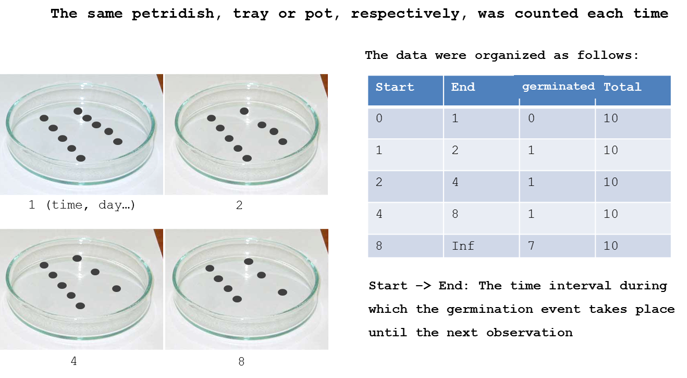

# Seed Germination

Most weeds multiply and spread by seeds and understanding how seeds germinate, and how ambient factors affect seed dormancy, germination, vigor and early growth is instrumental for our continuous struggle to deplete  soils of weed seeds. On agricultural land in Denmark we find about 30,000 viable weed seeds/m^2. It has dropped to half of what we found 45 years ago. This drop is due to many factors, but probably the most important one is the continuous use of herbicides.

The weed's ability to set seed and the seeds' ability to germinate is therefore important for us to try understand and  counteract seed soil bank enrichment with agronomic means. Therefore,  seed testing experiments to assess germination ability and vigor should support future action of depleting weed pressure.

The International Seed Testing Association [ISTA](https://www.seedtest.org/en/home.html) produces internationally agreed rules for seed sampling and testing and disseminates knowledge in seed science and technology. This facilitates seed trading nationally and internationally and is focusing on agricultural species. The principles of studying agricultural species and weed species are the same, but for weed species we are not interested in certifying their germinability, but to discover how to counteract their germination ability and vigor. In crop science and breeding the aim is the opposite to select for germinability and vigor. 

Nonlinear regression is commonly used to evaluate cumulative germination in cause of time, temperature or other external gradients.  This approach, however, is problematic as it ignores that successive observations on the germination curve are highly correlated. The total number of seeds that have germinated at a particular time is highly dependent on the number of seeds that already have germinated. Moreover, variation in the proportions of germinated seeds will vary with time, being largest at intermediate monitoring intervals and smallest at the initial and final intervals, where germination activity is low. This means that the fundamental assumptions implicitly underlying nonlinear regression (independence among proportions and variance homogeneity) are not met. 

In experiments, where new batches of seed are used for each inspection time, data  can be analyzed by well-established models for binomial data such as log-logistic regression or other generalized linear models.

In experiments where the same batch of seeds is followed over time, the same seeds are observed repeatedly  for some pre-specified duration of an experiment. We observe  the waiting time until the event of interest occurs and the resulting data are often referred to as event-time or time-to-event data. 

In this chapter we will concentrate on time-to-event data  [Ritz et al. 2013](http://www.sciencedirect.com/science/article/pii/S1161030112001360). Figure 14.1 shows the basic arrangement of this kind of experiment and how we arrange the data in R.



For various reasons germination need not occur at all during the experiment. We refer to this  as right-censoring. Consequently, a plausible statistical model has to incorporate that the event of interest, seed germination,  may occur after termination of the experiment, assigning a positive probability to the situation that germination is not observed. This is why the final inspection time has an `Inf` value that means infinity concludes the experiment.

Also, the germination is obviously not observed exactly at the very point in  time, when the event took place. For instance, seeds in petridishes may only be inspected on a daily  or weekly basis and in case  a seed has germinated the only information we get:  because germination took place  between  two inspection intervals. This type of time-to-event data is often referred to as grouped data or interval-censored. As a consequence an appropriate model should be specified by means of the probability of germination within the monitoring intervals. This probability will depend heavily on the  monitoring intervals. Ignoring this grouped-data structure may lead to biased estimates. The finer the time grid the smaller the error caused by ignoring discretization.

## Example 1: Chickweed

```{r  message=FALSE}
library(drc)
head(chickweed,3)
tail(chickweed,3)
chickweed.m1 <- drm(count~start+end, data = chickweed, fct = LL.3(names=c("b","MaxGerm","T50")), type = "event")
```

Notice the model `count~start+end` operates with two independent variables the `start` and `end`. It means that the intervals between inspection can vary; there is not need to have the same inspection intervals for the whole period of the experiment.

```{r}
summary(chickweed.m1)  
```

The output from the `drm()`is the same as for other non-linear regressions, and the three parameter log-logistic model, `LL.3()`, is also familiar in dose-response work. What is new here is that the model needs `start+end,...,type = "event"`. The regression is illustrated in Figure \@ref(fig:figgermchick).

(ref:figgermchickcap) _Germination curves of ALS resistant_ Stellaria media _from Danish fields in 2001. The code is from the example data set chickweed in the  `drc` package  [Ritz et al. 2013](http://www.sciencedirect.com/science/article/pii/S1161030112001360). Note that we now use the actual time on the x-axis and not the logarithm as we did in the dose-response curve chapter._

```{r figgermchick, fig.cap='(ref:figgermchickcap)', fig.asp=0.6}
par(mfrow=c(1,1), mar=c(3.6,3.6,.5,.5), mgp=c(2.5,.7,0))
plot(chickweed.m1, xlab = "Time (hours)", ylab = "Proportion germinated", 
     xlim=c(0, 340), ylim=c(0, 0.25), log="", lwd=2, cex=1.2, bty="l")  
```

On the basis of the regression parameters we can see that the maximum germination rate is not that high and the $T_{50}$ is 196 hours, meaning that it takes 196 days to reach 0.20/2= 0.1 or 10% germination. The interesting biological parameters are the upper limit (maximum germination) 0.20 (0.03) and the time to 50% germination, $T_{50}$, 196 (2.5).

As was the case in the dose-response chapter we can also estimate how long it takes to reach 10 or 90 percent germination.

```{r}
## Calculating t10, $T_{50}$, t90 for the distribution of viable seeds
ED(chickweed.m1, c(10, 50, 90), interval="delta")
```

If a cumulative germination curve had been analysed by a nonlinear regressions, the parameters would be similar, but their standard errors would be overly precise. If we  are interested only in the curve fitting and not the uncertainties  of parameters, either way of fitting may suffice. But usually we want to get the correct standard error of parameters to compare germination ability and/or vigor among species, biotypes, or environments, and the time-to-event regression is the appropriate way to better estimate the uncertainty in germination estimates, and may prevent us from drawing incorrect conclusions.

## Example 2: *Bromus tectorum*

Another example uses germination data for three different biotypes of *Bromus tectorum* collected in Wyoming. Seeds were placed in petri dishes on moist filter paper in a germination chamber. The petri dishes were checked for germinated seeds once daily from the initiation of the experiment for 20 days. Each day the number of newly germinated seeds was recorded.

```{r message=FALSE}
germ.dat<-read.csv("http://rstats4ag.org/data/broteGerm.csv")
head(germ.dat,3)
```

There are 6 columns in the data set, the `Source`  is the *B. tectorum* biotype, `starttime` and `endtime` denote the beginning and end of the interval represented by each recording time. This is similar to the chickweed data set. The `Daily.germ` column represents the number of germination events that occurred since the last observation. The `Cum.germ` column is a cumulative total that is often used (incorrectly) for analyzing germination over time. 

The final observation in this experiment occurred 20 days after it began. Therefore, we have an interval in the data set from time period 20 to `Inf`. Many of the petri dishes had not germinated all seeds at the final observation. We don't know for certain that these seeds *never* would have germinated. All we can say is that they had not yet germinated at the final observation of day 20. In the data set, we incorporate this uncertainty by recording the number of non-germinated seeds in the interval 20 to `Inf`. 

(ref:figbrotegermcap) _Regression fits for the time-to-event 3 parameter log-logistic regression. Please note that the curves for the time to event do stop at 20 days, because we do not know about future germination beyond 20 days._

```{r figbrotegerm, fig.cap='(ref:figbrotegermcap)', fig.asp=0.6}
event.drc<-drm(Daily.germ ~ starttime+endtime, Source, data=germ.dat, 
               fct=LL.3(names=c("Slope","Max","T50")), type="event",
               upperl=c(NA,1,NA))
summary(event.drc)
par(mar=c(3.6,3.6,.5,.5), mgp=c(2,.7,0))
plot(event.drc, log="", #ylim=c(0,1), xlim=c(0,20),  bty="l", 
     ylab="Proportion of germinated seed", xlab="Time (d)",
     legendPos=c(20,.40), pch=1:3)
```

In this code, we have set the `names` argument within the `drc` fitting function `LL.3()`. By default, the three parameters are named `b, d`, and `e`. For users who deal with these models on a regular basis, it is certainly acceptable to leave the default parameter names and interpret them accordingly. However, renaming the parameters to `Slope`, `Max`, and $T_{50}$ provides a useful reminder of how to interpret the parameters in the model output. This is especially helpful when presenting the results to someone unfamiliar with `R` syntax.

In germination studies, all three parameters have some biological interpretation. The upper limit being the maximal germination, with an upper limit set at 1 (or 100% of the seed); $T_{50}$ is the time taken to reach 50% germination relative to the upper limit. The slope could give an indication of how quickly seed germination reaches completion once the process has begun. The $T_{5}$ or $T_{95}$ (the time required for 5 and 95 percent of the seeds to germinate, respectively) can also be estimated in relation to the upper limit.

```{r}
#The ED5,ED50,and ED95 for the the germination
ED(event.drc,c(5,50,95), interval="delta")
```

Usually the $T_{50}$ is the most precise estimate, this does also apply here when we look at the 95% confidence interval or the coefficient of variation.

```{r}
#Coefficient of variation for ED50
T50<-ED(event.drc,c(50),display=FALSE)[,2]*100/ED(event.drc,c(50),display=FALSE)[,1]
T50
#Coefficient of variation for ED5
T5<-ED(event.drc,c(5),display=FALSE)[,2]*100/ED(event.drc,c(5),display=FALSE)[,1]
T5
#Coefficient of variation for ED95
T95<-ED(event.drc,c(95),display=FALSE)[,2]*100/ED(event.drc,c(95),display=FALSE)[,1]
T95
```

Direct comparison of model parameters can be done by using the `compParm()` function in `drc`. Because we have used the `names` argument above, we need to specify those names in the `compParm()` syntax. If we had not used the `names` argument, we would compare slopes by specifying the *b* parameter, maximum asymptote *d* parameter, and $T_{50}$  the *e* parameter. 

```{r}
compParm(event.drc, "Slope")
```

Slopes are different between S2 and the rest as also seen in Figure \@ref(fig:figbrotegerm). It means that the vigor of the germination process for S3 is greater that for the other two biotypes. Looking at the upper limit:

```{r}
compParm(event.drc, "Max")
```

The maximum germination for biotypes S2 and S3 is similar, but biotype S1 has a lower maximum germination than do the other two biotypes. Finally, the time required for 50% germination can also be compared in a similar manner.

```{r}
compParm(event.drc, "T50")
```

The $T_{50}$ (which is also be associated with speed of germination) are different form each other. Looking at Figure \@ref(fig:figbrotegerm), it is noted that the logistic regression does not seem to be that good to capture the upper limits for S2 and S3, and perhaps the symmetric sigmoid curves would could be replaced by an asymmetric one. By using the Weibull 1 model, `W1.3()`, which is asymmetric (i.e. $T_{50}$ is not a parameter in the model). We may be better to model the upper limit. However, the Weibull 1 is rather sensitive to too many zeros so we must get rid of those in order to get a proper fit.This is done by omitting observations with the functions `subset(germ.dat, Daily.germ!=0)`. This function gives some warnings that we can ignore for the time being.

```{r, warning=FALSE}
#Fitting LL.3() with the same conditions as for the Weilbull 1 model
event.drc.1<-drm(Daily.germ ~ starttime+endtime, Source, 
                 fct=LL.3(names=c("Slope","Max","T50")),
                 data=subset(germ.dat, Daily.germ!=0), type="event")

#Fitting W1.3()
event.drc.W1 <- drm(Daily.germ ~ starttime+endtime, Source, 
                    fct=W1.3(), 
                    data=subset(germ.dat, Daily.germ!=0), type="event")

#To extract the T50
ED(event.drc.1,50) # LL.3 model
ED(event.drc.W1,50) # W1.3 model
```

The $T_{50}$ did not change much but in Figure \@ref(fig:figbrotew), there are subtle changes in the curve on the right side by going from a log-logistic `(LL.3())` to an asymmetric `(W1.3())` curve. There are some differences in the way the upper limit is described by the two models. The Weibull 1 seems to do a better job than the log-logistic.

(ref:figbrotewcap) _An assymetric Weilbull 1 model(`W1.3()`) shown with black lines, compared with the symmetric log-logistic model (`LL.3()`) in red._

```{r figbrotew, fig.cap='(ref:figbrotewcap)', fig.asp=.7}
par(mfrow=c(1,1), mar=c(3.2,3.2,0.5,0.5), mgp=c(2,.7,0))
plot(event.drc.W1, log="", ylim=c(0,1), xlim=c(0,20), bty="l",
     ylab="Proportion of germinated seed", xlab="Time (d)",
     legendPos=c(20,.40))
plot(event.drc.1, log="", ylim=c(0,1), xlim=c(0,20),   
     type="none",
     add=TRUE, col=c(2), legendPos=c(20,.40))
```

Even though the changes are not dramatic the AIC does drop somewhat when going form a log-logistic to an Weibull 1, which indicates that overall the asymmetric `W1.3()` fits best to the data.

```{r}
AIC(event.drc.1, event.drc.W1)
```

***** 
