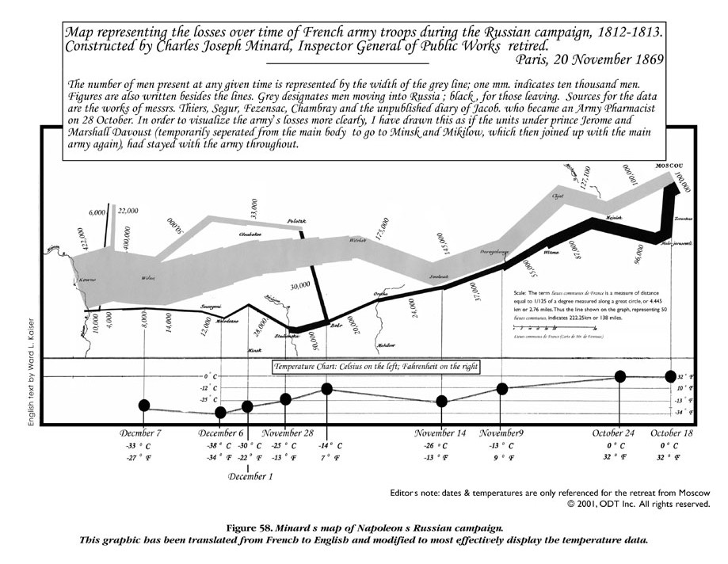

# Visualization

Pictures and graphs  may say more than 1000 words. After collection of data, the hard work of analyzing them according to the experimental design plans begins. But before you dig too much into statistics and jump to conclusions on the basis of the statistical tests, you should actually look at the data graphically. You must try to illustrate the data in such a way that it is informative not only to you, but also to  potential readers of the project or the paper you wish to publish. In a way you could look at the visualization as the interface between science and art. One of the best examples of this merger of science and art is the campaign of Napoleon in Russia 1812-1813.

```{r minardPlot, echo=FALSE, fig.cap="_Charles Joseph Minard (1781-1870) is most widely known for a single work, his illustration of the fate of Napoleon's Grand Army in Russia._ Source: http://www.datavis.ca/gallery/re-minard.php"}

```

Minard's work (Figure \@ref(fig:minardPlot)) has been called one of the best graphs ever produced in thematic cartography and statistical graphics. In short, it shows the size of the Army at the beginning of the attack and at the final retreat, some of the more important battles and the temperature during the retreat from Moscow. It contains so many dimensions and so much information and history that usually fill hundreds of pages in history books. Our work in weed science is rarely that exciting for the general public; although our discipline can be an esoteric at times, it plays a great role in the food production and sustainability of the farming and environment in the world.

## Base R Graphics

Visualization of data is an important step to get a first impression of the quality of data and to see if some observations stand out from the rest. It can also help us observe whether the data show systematic relationships. Base R graphics are a quick and extensible way to do both this preliminary data inspection, but also for creating publication quality figures for manuscripts and presentations. We will begin this chapter with some basic examples of how to customize base R graphics to create high-quality figures. 

### Scatterplots

One of the most common figures is a scatter plot or x-y plot - typically used to see the relationship between an independent variable (x-axis) and a response variable (y-axis), although often used to show other relationships as well. Without much work, we can get a very simple scatterplot suitable for inspecting the data in the `cars` data set that is part of the base `R` installation (Figure \@ref(fig:scatter1)).

> Code to produce Figure \@ref(fig:scatter1):

```{r scatter1, fig.asp=0.6, fig.cap="_A most basic scatterplot in R, showing the speed of cars and the distance required for the car to stop. The tilde ~ can be difficult to find on some keyboards, depending on you language, but it is the defined ASCII code 126. In Windows you can press the ALT key, activate Num. Lock and press 126._"}
plot(dist ~ speed, data = cars, main="Recorded in the 1920's")
```

While Figure \@ref(fig:scatter1) is adequate for preliminary inspection of one's own data, it is woefully insufficient for submission to a journal. We can improve the figure greatly by making some simple additions to the basic plot code. To create Figure \@ref(fig:scatter2), the `par()` function is called to change some of the default graphing parameters. In this case we adjust the margins so that the bottom and left margins are set to 3.2, the top and right margins are set to 0.5. We have removed the main title (since that information would typically be contained in a figure caption according to most journal instructions), and also adjusted the axis labels, by setting them closer to the axis compared to default values using `mgp`. The `mgp` argument requires 3 numbers, which set the distance from the axis for the axis title, axis labels, and axis line, respectively. The defaults for `mgp` are 3, 1, 0 - so in this code we've removed some of the axis white space by moving the labels closer to the axis. We have also added axis labels and a main title, changed the plotting character (`pch=19`, which is a closed circle), and added some transparency to the points using the `rgb()` function and the `alpha` argument. Finally, we have, adjusted the x-axis to include 0, and removed the box around the figure by setting `bty="n"`. Setting `bty="l"` will leave the bottom and left lines of the box, and `bty="o"` will plot the entire box (the default).

> Code to produce Figure \@ref(fig:scatter2):

```{r scatter2, fig.asp=0.6, fig.cap="_An improved scatter plot showing the cars data._"}
par(mar=c(3.2,3.2,0.5,.5), mgp=c(2,.7,0))
plot(dist ~ speed, data = cars,
     xlab="Speed of car (mph)", 
     ylab="Distance required to stop (ft)",
     pch=19, col=rgb(red=.3, blue=.3, green=.3, alpha=0.7),
     bty="n", xlim=c(0,25))
```

### Box and Whisker Plots

If we have some data where the "treatment" is not based upon a continuous x variable, then we can  illustrate the variation with a boxplot. The data for this example `InsectSprays` are also included with the basic R installation.

> Code to produce Figure \@ref(fig:boxjitter):

```{r boxjitter, fig.asp=0.5, fig.cap="_Counts of insects in agricultural experimental units treated with different insecticides._"}
par(mfrow = c(1,2), mar=c(3.2,3.2,.5,.5), mgp=c(2,.7,0))
plot(count ~ spray, data = InsectSprays)
  legend("topleft","(a)", bty="n")
plot(count ~ as.numeric(spray), data = InsectSprays, pch=19)
  legend("topleft","(b)", bty="n")
```

Figure \@ref(fig:boxjitter) illustrates how the default `plot()` function works in R; if the x-axis is based on factors (A through F) you automatically get a boxplot (Figure \@ref(fig:boxjitter)a), where the median and the quartiles are shown, as well as an indication of extreme observations. On the other hand, if we convert the factors A through F to numerical values of x by using  function `as.numeric()`,  we get an ordinary continuous x variable (Figure \@ref(fig:boxjitter)b). Factor A becomes 1 and factor B becomes 2 and so on. In this particular data we can change the names (e.g., F is becoming A and A becoming F) of the various sprays and it will just change the order on the x-axis. In doing so it could have a great influence on perceived relationship.

It is possible to combine these two panels in Figure \@ref(fig:boxjitter) into a single panel, to more concisely show a high level of detail on the variance within and among treatments. To do so, we modify the code for Figure \@ref(fig:boxjitter) by using `points()` instead of `plot()` for the second plot so that the points are added to the first plot instead of creating a new plotting space; jittering the points, or offsetting them slightly, in the 'x' direction so that counts that are similar or the same can be more easily seen; adding some transparency to the points so that we can see if multiple points are on top of one another; and by removing the outlier points from the initial boxplot since all points will be added later. 

> Code to produce Figure \@ref(fig:boxjitter2):

```{r boxjitter2, fig.asp=0.5, fig.cap="_Counts of insects in agricultural experimental units treated with different insecticides - shown with points on top of the boxplots._"}
par(mfrow = c(1,1), mar=c(3.2,3.2,.5,.5), mgp=c(2,.7,0))
plot(count ~ spray, data = InsectSprays, pch=NA)
points(count ~ jitter(as.numeric(spray)), data = InsectSprays,
       pch=19, col=rgb(.1,.4,.8, alpha=0.7))
```

For data with continuous x we can also directly call the `boxplot()` function rather than relying on `R` to correctly identify the independent variable type. We can also use some additional arguments within the `boxplot()` function to modify the look of our boxplot (Figure \@ref(fig:horizbox)). 

> Code to produce Figure \@ref(fig:horizbox):

```{r horizbox, fig.cap="_The counts of insects in agricultural experimental units treated with different insecticides. Setting the option `horizontal=TRUE` creates a horizontal boxplot instead of vertical; we can use the `names` argument to add product names, and the `las` argument rotates the axis labels to horizontal._", fig.asp=.4}
par(mfrow = c(1,1), mar=c(3.2,8.2,.5,.5), mgp=c(2,.7,0))
boxplot(count ~ as.numeric(spray), data = InsectSprays, horizontal=TRUE, pch=NA,
        names=c("Antibug","Bug Kill","Clear","Destroy","Endgame","Fuhgeddaboudit"),
        las=1, xlab="Insect counts", ylab="")
points(jitter(as.numeric(spray)) ~ count, data = InsectSprays,
       pch=19, col=rgb(.1,.4,.8, alpha=0.7))
```` 

### More than Two Variables

One of the classical examples in statistics are the Fisher's or Anderson's  iris data that give measurements of the sepal length and width and petal length and width, respectively, for each of three species of Iris. The `pairs()` function is a powerful (and quick) way to show the pairwise relationships between many variables at the same time. 

> Code to produce Figure \@ref(fig:sepalPairs):

```{r sepalPairs, fig.asp=1, fig.cap="_Sepal and petal measurements on 50 flowers from each of three species of Iris_: I. setosa, I. versicolor, _and_ I. virginica."}
head(iris,3)
par(mar=c(2.2,2.2,2.2,2.2), mgp=c(2,.7,0))
pairs(~ Sepal.Length + Sepal.Width + Petal.Length + Petal.Width, data=iris)
```

It is obvious from Figure \@ref(fig:sepalPairs) that the relationships sometimes seem to be separated into two groups. However, knowing that the data are separated into  three _Iris_ species, we could once more use `as.numeric()` to identify which data belong to which species, and make each species a different color (Figure \@ref(fig:sepalPairsColor)). 

> Code to produce Figure \@ref(fig:sepalPairsColor):

```{r sepalPairsColor, fig.asp=1, fig.cap="_By using the argument `col = as.numeric(iris$Species)` the colors separate the various species, making the differences and relationships among species obvious._"}
pairs(~ Sepal.Length + Sepal.Width + Petal.Length + Petal.Width, data=iris,
     col = as.numeric(iris$Species))
```

The `pairs()` function has even more power when used together with a function called `panel.cor()` that can be found at the end of the `?pairs` help page. If you find outliers in  data and wish to omit them, then by using the original panel function you must omit the whole observation. Here, the function panel.cor has been improved by using the argument (`use = "pairwise.complete.obs"`).

```{r}
panel.cor <- function(x, y, digits = 2, prefix = "", cex.cor, ...) {
  usr <- par("usr"); on.exit(par(usr))
  par(usr = c(0, 1, 0, 1))
 r <- abs(cor(x, y, use = "pairwise.complete.obs"))
  txt <- format(c(r, 0.123456789), digits = digits)[1]
  txt <- paste(prefix, txt, sep = "")
  if(missing(cex.cor)) cex.cor <- 0.8/strwidth(txt)
  text(0.5, 0.5, txt, cex = cex.cor * r)
}
```

For the average R user (and even the authors of this chapter), this looks very complicated and it probably is; but by running it before you run the `pairs()` you get a fantastic overview of relationships among variables. In soils and plant sciences you often have numerous variables, i.e. elements or chemicals or morphological attributes. Before launching the statistics weaponry it would be nice to see the relationships between these variables, as we will show using the _Nitrate_ data set.

```{r}
Nitrate <- read.table("http://rstats4ag.org/data/nitrate.txt", header=T)
head(Nitrate,3)
``` 

We execute the `panel.cor()` function and call it within the `pairs()` function to see the relationships between all variables in the data set. Note that the correlations are absolute.

> Code to produce Figure \@ref(fig:soilPairsPanel):

```{r soilPairsPanel, fig.asp=1, fig.cap="_The lower part of the panel shows the relationships soil variables. The upper part shows the absolute correlation coefficients, the font sizes of which are based upon the magnitude of the correlation._"}
pairs(Nitrate, lower.panel = panel.smooth, upper.panel = panel.cor)
``` 

It is clear from Figure \@ref(fig:soilPairsPanel) that K has virtually no correlation with the other variables. This is solely due to an observation with a rather high K concentration, seen in the last panel row. In a case like this, it would certainly be wise to determine what is going on with that particular observation - measurement or data entry errors could be potential explainers. For now, we will exclude that observation to look at the overall trends. To do so, we can simply find the observation with the largest K-value:
```{r}
which.max(Nitrate[["K"]])
```

The maximum value is in the 10th observation. Secondly, we can change this putative outlier to a missing value (expressed as 'NA' in `R`). To do this, we define a new data set (`Nitrate1`) in order to not change the original data we have. We will then select the value of K that matches the maximum value of K (the 10th observation), and replace that value with 'NA':

```{r}
Nitrate1<-Nitrate
Nitrate1$K[Nitrate1$K==max(Nitrate1$K)] <- NA # This is missing value in R
```

We can then re-run the `pairs()` function on the new data set to see how removal of the outlier changes the relationship between K and the other variables.

> Code to produce Figure \@ref(fig:pairsPanelnoOutlier):

```{r pairsPanelnoOutlier, fig.asp=1, fig.cap="_K has now gotten a higher correlation with each variable because the concentration in th 10th observation has been set to missing value.  Notice the other correlations have not changed, only K._"}
pairs(Nitrate1, lower.panel = panel.smooth, upper.panel = panel.cor)
``` 

A field experiment, with mechanical control of weeds in cereals, was done  by measuring the effect on leaf cover as a function of  number of harrow runs. The harrowing was done either along the crop rows or across the crop rows at a certain stage of cereal development.

```{r}
leafCover<-read.csv("http://rstats4ag.org/data/LeafCover.csv")
head(leafCover,3)
```

If we have more than one relationship within a data set, we can separate them as done below. There is a classification with the factors levels: Across and Along. In Figure \@ref(fig:harrowSingle) you can see how you can identify the observation within harrowing Along and Across

> Code to produce Figure \@ref(fig:harrowSingle):

```{r harrowSingle, fig.asp=0.6, fig.cap="_The leaf area of weeds and crop in relation of the intensity of harrowing either across or along the crop rows. Note how we changed Across and Along to numerical values by using the function `as.numeric()` in order to get different symbols._"}
par(mar=c(3.2,3.2,.5,.5), mgp=c(2,.7,0))
plot(Leaf~Intensity, data = leafCover, bty="l",
     pch = as.numeric(Direction),
     xlab="Harrow intensity", ylab="Leaf area")
legend("bottomleft", levels(leafCover$Direction), pch=c(1,2))
```

Obviously, there is a relationship, and this will be properly addressed in the ANCOVA chapter. There are also other plotting facilities that can be used the `xyplot()` in the package,lattice, which comes with basic R.

> Code to produce Figure \@ref(fig:harrowLattice)

```{r harrowLattice, fig.asp=0.5, fig.cap="_The individual plots for each classification variable. Notice that the variable after the `|` defines the classification._"}
library(lattice)
xyplot(Leaf ~ Intensity | Direction, data = leafCover)
```

## ggplot2

Within the R community there is an array of versatile packages to visualize data, we have barely scratched the surface showing a few examples we felt may be of immediate interest. The numbers of graphic interfaces are numerous and increasing, some are easier to use than others, and sometimes it takes a rather large amount of time to get the hang of it. One package that has received a great deal of (much-deserved) praise is `ggplot2`. The 'gg' branding is "the grammar of graphics." 

We will not spend too much time discussing the syntax of `ggplot2`, but we will provide several examples of plots created in this package to illustrate its powerful and elegant capabilities. We can begin by using the same `leafCover` data in Figures \@ref(fig:harrowSingle) and \@ref(fig:harrowLattice). In the 'gg' way of doing things, we first provide the data set and the primary variables of interest, then continue adding on additional layers to the plot, separated by a `+`. 

> Code to produce Figure\@ref(fig:ggharrow)

```{r ggharrow, fig.asp=0.6, fig.cap="_Harrowing intensity data shown using ggplot2._"}
library(ggplot2)

ggplot(leafCover, aes(x=Intensity, y=Leaf)) +
  geom_point(aes(color=Direction, shape=Direction)) +
  stat_smooth(aes(color=Direction, linetype=Direction), method="lm", se=TRUE) +
  ylab("Leaf area") + xlab("Harrow intensity") +
  theme_classic() + theme(legend.position="right") 
```

One of the strengths of the `ggplot2` package is the ability to use linear or local regression models using the `stat_smooth()` function, as shown in Figure \@ref(fig:ggharrow). In this example, the linear model fit is drawn in the same colors as the points, and a gray shaded area is added that represents the standard error. All of these options can be customized (for example, by changing to `se=FALSE` to remove the error shading). 

To create a barplot with confidence intervals from a one way analysis of variance, ANOVA, we can again use the `InsectSprays` data set, and start by generating the linear model. The next step is to turn the relevant results from the ANOVA into a data.frame, for use in plotting, then passing that information along to the `geom_bar()` and `geom_errorbar()` functions within `ggplot`. 

```{r}
m1<-lm(count~spray-1,data=InsectSprays)
#Note the -1 presents the parameteres as sheer means not as differences 
coef(m1) #the means
confint(m1) #the conficence intervals
d.frame.m1<-data.frame(cbind(coef(m1),confint(m1)),pest=rownames(confint(m1))) #Combining the two
head(d.frame.m1,2)
```


The results are provided in Figure \@ref(fig:ggSprayBar). When doing an ANOVA to separate treatment effect it is not correct to give the standard error of the replicates within a treatment. It is based upon too few observations and essentially is a waste of ink. The only correct way is to use the ANOVA standard error. The trained weed and crop scientists will know this rather simple use of ANOVA results is not obeyed in a large proportion of papers with tables that give the individual treatments standard errors. But because this redundant  presentation of data is generally accepted in most journals, whatever their impact factors, it should be discouraged. 

> Code to produce Figure\@ref(fig:ggSprayBar)

```{r ggSprayBar, fig.asp=.6, message=FALSE, fig.cap="_InsectSpray data in a barplot with 95 % confidence intervals using the ggplot2 package._"}
ggplot(d.frame.m1, aes(x=pest, y=V1)) +
  geom_bar(stat="identity", fill="lightgreen",
           colour="black") +
  geom_errorbar(aes(ymin=pmax(X2.5..,0), 
                    ymax=X97.5..), width=0.5) +
  xlab("Pesticide Spray")+
  ylab("Insect Counts")

````

Paired barplots are another (more complicated, but often useful) way of arranging barplots. This is relevant for some factorial or split-plot designs. For example using data from a study looking at five crop species each grown in two different row orientations (east-west vs north-south), it makes sense to group the data by crops to look for consistent trends of row orientation (Figure \@ref(fig:ggCropOrient)). 

> Code to produce Figure\@ref(fig:ggCropOrient)

```{r ggCropOrient, fig.asp=0.6, fig.cap="The effect of the orientation of crop sowing on the yield five crops. The illustration is based on means not raw data, so there are no error bars."}
CropRowOrientation<-read.csv("http://rstats4ag.org/data/CropRowOrientation.csv")
head(CropRowOrientation)
c <- ggplot(CropRowOrientation)
c + aes(x = Crop, y = Yield, fill = Row, color = Row) +
      geom_bar(stat="identity", width=.5, position="dodge")
```

*****
